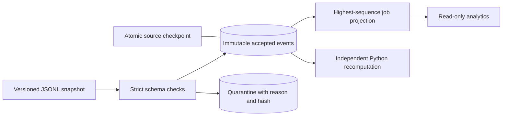

# Incremental data pipeline

Turn workflow state-change events into inspectable current-state analytics. The pipeline accounts for duplicate, late, malformed and out-of-order observations, preserves accepted events and source lineage, quarantines conflicts, and resumes interrupted immutable-file ingestion from committed checkpoints.

## Quick start

Python3.12/3.13 and [uv](https://docs.astral.sh/uv/) required.

```sh
make setup
make test
make seed
make demo
# http://127.0.0.1:8114
```

The dashboard shows jobs/records by tenant and terminal state, accepted-event/lineage totals, quarantine reasons and each content-addressed source checkpoint. Its HTTP API is read-only. CLI ingestion and rebuilding are operator controls and are never exposed as anonymous web endpoints.

```sh
uv run python3 -m pipeline.cli generate data/demo.ndjson --jobs 100 --seed 17
uv run python3 -m pipeline.cli --db analytics.sqlite ingest data/demo.ndjson --batch-size 20
uv run python3 -m pipeline.cli --db analytics.sqlite analytics
uv run python3 -m pipeline.cli --db analytics.sqlite verify
uv run python3 -m pipeline.cli --db analytics.sqlite rebuild
make benchmark
```

A JSONL source is an immutable snapshot. The SHA-256 of its bytes identifies its checkpoint. Appending/changing a file creates a new source snapshot: previously accepted events deduplicate by ID while new events update analytics. That gives incremental state updates without requiring a broker. Each batch atomically commits event records, latest-state projection, lineage, quarantine and checkpoint. A killed process can resume; an incomplete transaction rolls back.

## Contract and architecture



Example event:

```json
{"schema_version":1,"event_id":"event-1","source":"durable-workflows","event_type":"job.state_changed","occurred_at":"2026-01-01T00:00:00Z","job_id":"job-1","tenant_id":"synthetic-alpha","sequence":1,"payload":{"state":"queued","kind":"data_import","attempt":0,"record_count":3}}
```

Schema1 permits additive fields. IDs must be bounded strings; sequence is a positive integer, timestamps must be explicit UTC and payload counts nonnegative integers. Booleans are rejected as integer values. Unsupported versions, malformed JSON, invalid fields and lines over16KB are quarantined. Quarantine stores a500-character preview and full raw-line hash, not a silently repaired event.

Event ID replay with identical canonical content is a duplicate. A different payload under the same ID or a different ID for an existing job sequence is quarantined. The first accepted identity remains authoritative; conflicting histories require operator reconciliation. We do not claim order-independent convergence between contradictory inputs. For valid histories, state uses the greatest job sequence, so late observations cannot rewind the job. Tenant/job identity scopes the sequence.

`events` retains source observations. `job_latest` is a derived analytical table. `lineage` records every accepted or duplicate source location; `quarantine` records rejected ones. The dashboard reports record counts associated with each current job state, not an assertion that all records succeeded. SQLite WAL with `BEGIN IMMEDIATE` serializes competing batch writers; multiple processes do not share an unsafe in-memory cursor.

## Validation and measured evidence

Tests cover duplicates, late/out-of-order updates, additive fields, conflicting IDs/sequences, invalid schemas, competing ingestion processes/threads, checkpoint resume, backfill deduplication, readonly HTTP, and a real child-process SIGKILL followed by replay recovery.

The benchmark generates2,000 synthetic jobs and6,000 distinct observations with duplicates/malformed cases, stops after3 batches, resumes, replays, backfills a changed source and rebuilds the analytical table. It compares SQL incremental/rebuilt state against a separate Python full-recomputation oracle over accepted observations and records timings/hashes/environment. Throughput is measured, never a preset claim. See `evidence/benchmark.json` for actual values and revision.

Integration with durable-workflows uses the same version1 event envelope. Export an authenticated owner's `/events` and save each JSON array element as one JSONL line, then ingest the saved snapshot. Final live integration proof is separately recorded in `evidence/integration.json`; a generator alone is not service integration evidence.

## Deployment, limits and licenses

`HOST` defaults to127.0.0.1, `PORT` to8114, and `PIPELINE_DB` configures storage. Docker configuration supplies a repeatable baseline; mount an isolated volume for persistent SQLite. No fault-control or arbitrary-file endpoint is public. Public demo status is recorded separately; a static analytical snapshot is not a live ingestion backend.

The input snapshot is capped at20MB and loaded into memory. The service is single-host SQLite, not a distributed stream processor. The generator and retained demo inputs are original MIT synthetic data. Real customer events or credentials are not included. There is no production privacy, completeness, latency SLA, distributed replication or infinite-retention claim. Code/data: MIT (`LICENSE`). FastAPI: MIT, uv: MIT/Apache-2.0; exact dependencies are locked.

Official implementation references: [SQLite transactions](https://www.sqlite.org/lang_transaction.html), [SQLite WAL](https://www.sqlite.org/wal.html), [FastAPI](https://fastapi.tiangolo.com/). Personal mastery and all draft resume wording remain pending user review. See `docs/interview-guide.md`.
